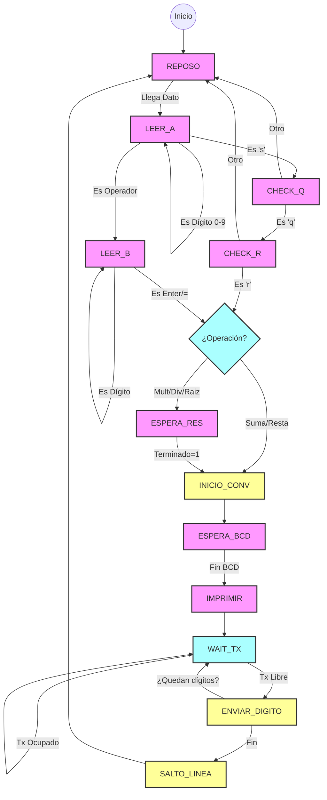
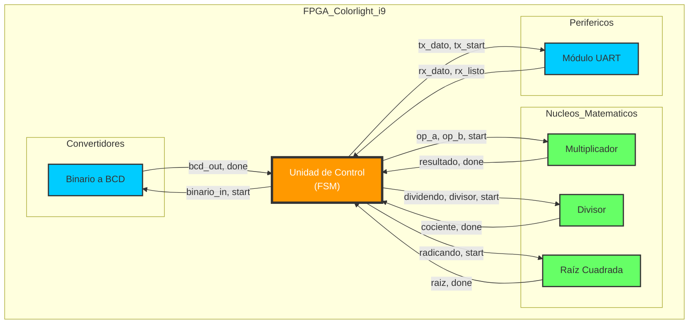

# Diagramas del Proyecto

## 1. Diagrama de Flujo (FSM)

```mermaid
graph TD
    %% Estilos
    classDef estado fill:#f9f,stroke:#333,stroke-width:2px;
    classDef decision fill:#aff,stroke:#333,stroke-width:2px;
    classDef proceso fill:#ff9,stroke:#333,stroke-width:2px;

    %% Inicio
    Inicio((Inicio)) --> REPOSO:::estado

    %% Lectura
    REPOSO -->|Llega Dato| LEER_A:::estado
    LEER_A -->|Es Dígito 0-9| LEER_A
    LEER_A -->|Es Operador| LEER_B:::estado
    LEER_A -->|Es 's'| CHECK_Q:::estado

    %% Rama SQR
    CHECK_Q -->|Es 'q'| CHECK_R:::estado
    CHECK_R -->|Es 'r'| CALCULAR:::estado
    CHECK_Q -->|Otro| REPOSO
    CHECK_R -->|Otro| REPOSO

    %% Lectura B
    LEER_B -->|Es Dígito| LEER_B
    LEER_B -->|Es Enter/=| CALCULAR

    %% Cálculo
    CALCULAR{¿Operación?}:::decision
    CALCULAR -->|Suma/Resta| INICIO_CONV:::proceso
    CALCULAR -->|Mult/Div/Raiz| ESPERA_RES:::estado
    
    %% Espera Hardware
    ESPERA_RES -->|Terminado=1| INICIO_CONV

    %% Conversión BCD
    INICIO_CONV --> ESPERA_BCD:::estado
    ESPERA_BCD -->|Fin BCD| IMPRIMIR:::estado

    %% Impresión con Semáforo
    IMPRIMIR --> WAIT_TX:::decision
    WAIT_TX -->|Tx Ocupado| WAIT_TX
    WAIT_TX -->|Tx Libre| ENVIAR_DIGITO:::proceso
    ENVIAR_DIGITO -->|¿Quedan dígitos?| WAIT_TX
    ENVIAR_DIGITO -->|Fin| SALTO_LINEA:::proceso
    SALTO_LINEA --> REPOSO
```

## 2. Datapath

```mermaid
graph TD
    %% Definición de Bloques
    subgraph FPGA_Colorlight_i9
        Controlador["Unidad de Control<br/>(FSM)"]:::cerebro
        
        subgraph Perifericos
            UART["Módulo UART"]:::bloque
        end

        subgraph Nucleos_Matematicos
            Mult["Multiplicador"]:::math
            Div["Divisor"]:::math
            Raiz["Raíz Cuadrada"]:::math
        end

        subgraph Convertidores
            BCD["Binario a BCD"]:::bloque
        end
    end

    %% Conexiones
    UART -->|rx_dato, rx_listo| Controlador
    Controlador -->|tx_dato, tx_start| UART

    Controlador -->|op_a, op_b, start| Mult
    Mult -->|resultado, done| Controlador

    Controlador -->|dividendo, divisor, start| Div
    Div -->|cociente, done| Controlador

    Controlador -->|radicando, start| Raiz
    Raiz -->|raiz, done| Controlador

    Controlador -->|binario_in, start| BCD
    BCD -->|bcd_out, done| Controlador

    %% Estilos
    classDef cerebro fill:#ff9900,color:white,stroke:#333,stroke-width:4px;
    classDef bloque fill:#00ccff,stroke:#333,stroke-width:2px;
    classDef math fill:#66ff66,stroke:#333,stroke-width:2px;
```